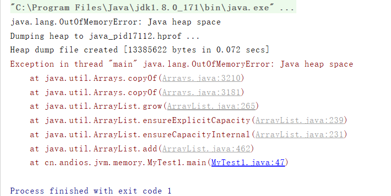
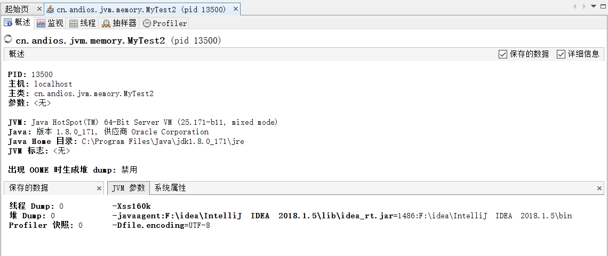
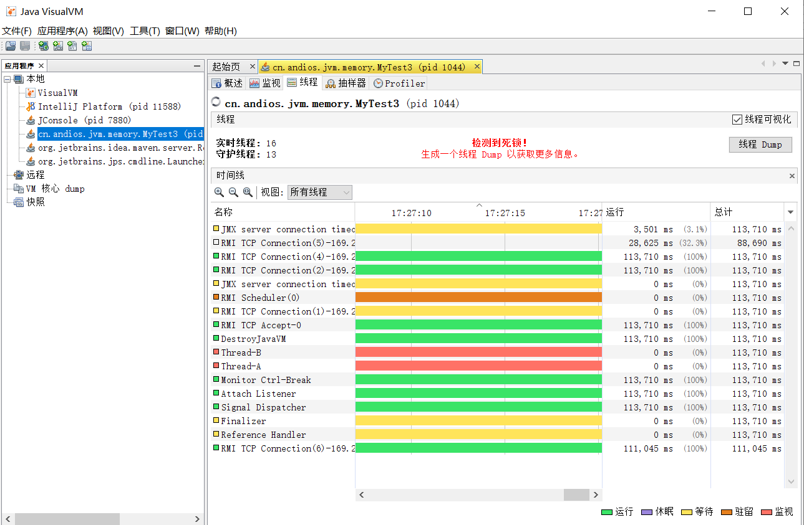
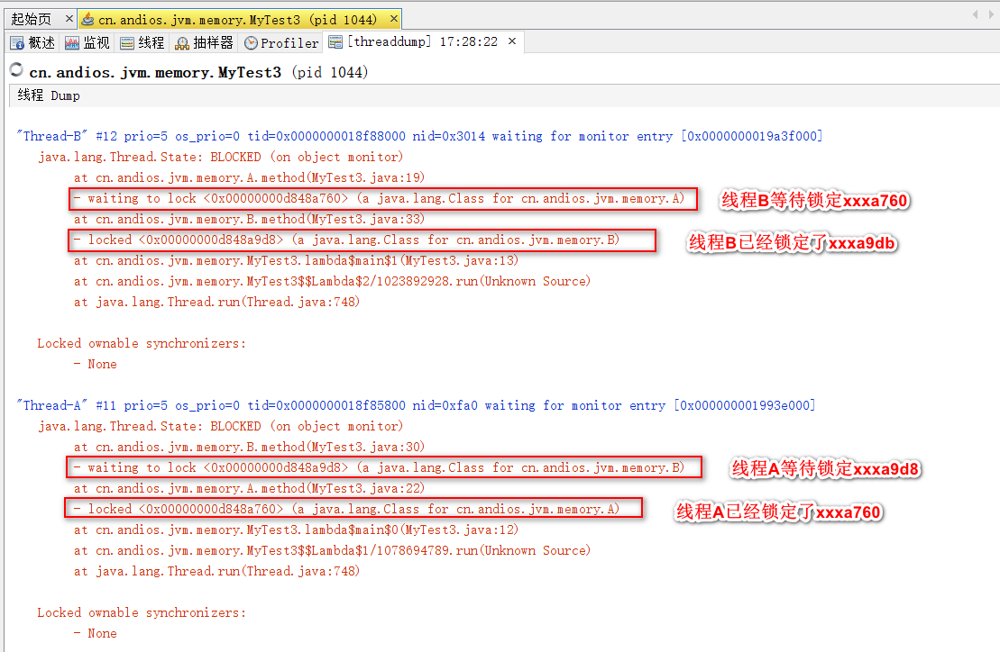
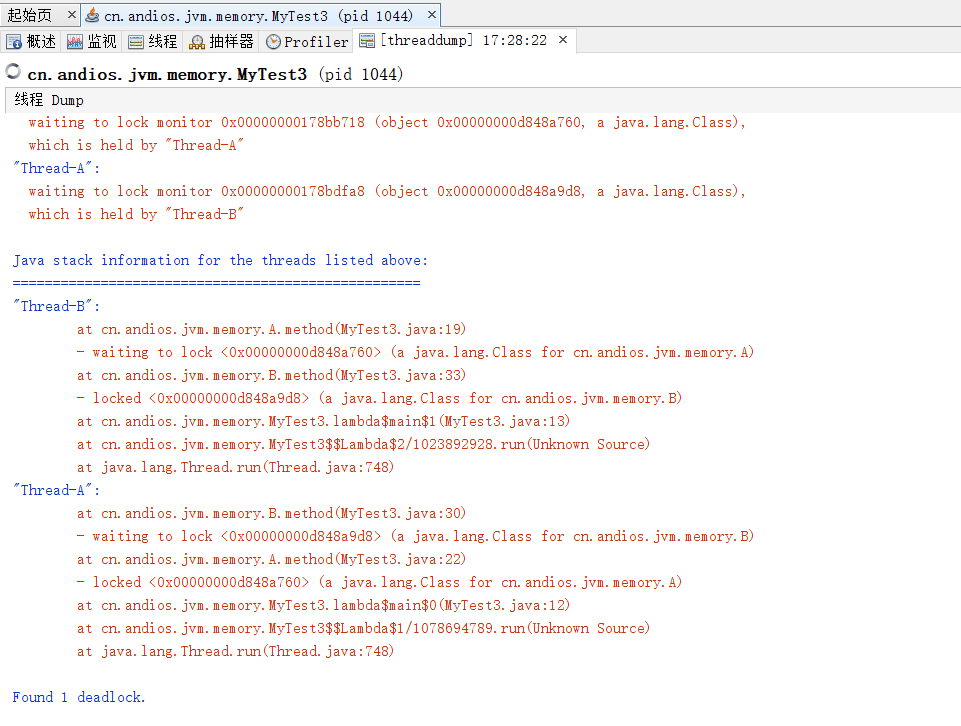
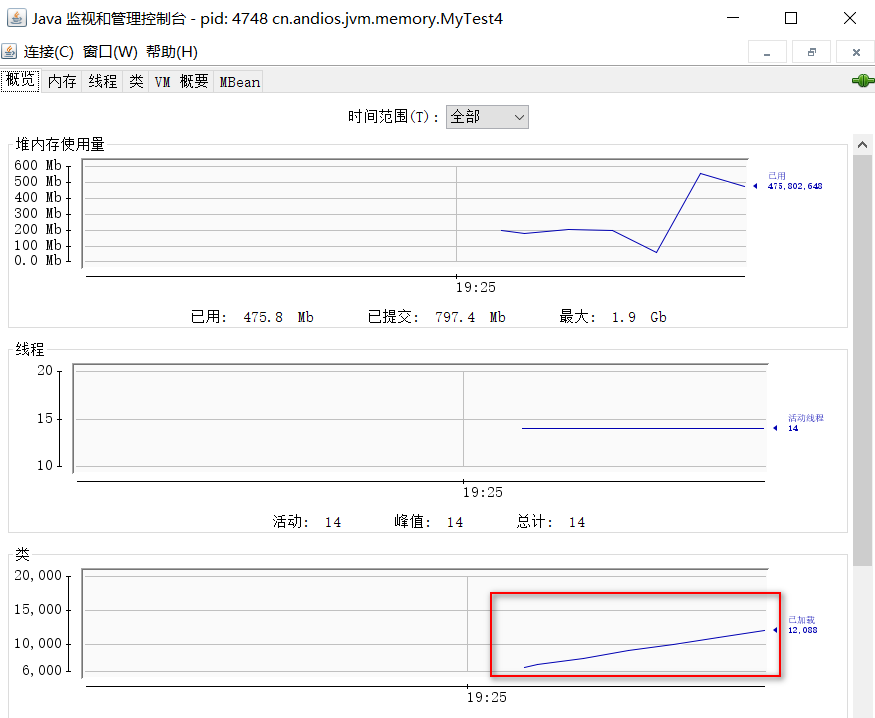
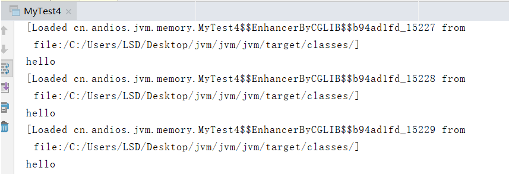

### jvisualvm

- `jvisualvm`是jdk自带工具，可执行文件位于`JAVA_HOME/bin`下，

#### 案例分析一：堆溢出 OutOfMemoryError：Java Heap Space

1. 测试代码

   ```java
   public class MyTest1 {
       public static void main(String[] args) {
           List<MyTest1> list = new ArrayList<>();
           for (;;){
               list.add(new MyTest1());
           }
       }
   }
   ```

2. 设置jvm参数

   ```java
   -Xms10m
   -Xmx10m
   -XX:+HeapDumpOnOutOfMemoryError		//生成转储文件
   ```

3. 运行报错`java.lang.OutOfMemoryError: Java heap space`，在项目根目录下生成`xxx.hprof`文件

   

4. 打开`jvisualvm`，文件---装入，选择生成的`xxx.hprof`文件，如图可以看到`jvisualvm`对`dump`文件的一些分析：

   

#### 案例分析二：虚拟机栈溢出 java.lang.StackOverflowError

1. 测试代码

   ```java
   public class MyTest2 {
       public static void main(String[] args) {
           //演示虚拟机栈溢出
           MyTest2 test = new MyTest2();
           try {
               test.test();
           } catch (Throwable t) {
               System.out.println(test.getLength());
               t.printStackTrace();
           }
       }
       private int length;
       public int getLength(){
           return length;
       }
       public void test(){
           length ++;
           test();
       }
   }
   
   ```

2. 设置参数

   ```
   -Xss160k
   ```

3.  运行报错：`java.lang.StackOverflowError`

4. 修改代码，在test()方法中加入

   ```java
           try {
               Thread.sleep(300);
           } catch (InterruptedException e) {
               e.printStackTrace();
           }
   ```

   避免程序退出太快，此时打开`jvisualvm`即可看到

   

   ​	双击，即可看到执行信息：

   

### jconsole

`jconsole`也是jdk自带的工具，上述案例分析二，如果用`jconsole`打开


​	可以看到这里还有”检测死锁“的功能

#### 案例分析三：deadlock

1. 测试代码

   ```java
   public class MyTest3 {
       public static void main(String[] args) {
           //演示死锁
           new Thread(()->{A.method();},"Thread-A").start();
           new Thread(()->{B.method();},"Thread-B").start();
       }
   }
   class A{
       public static synchronized void method(){
           System.out.println("method form A");
           try {
               Thread.sleep(5000);
               B.method();
           } catch (InterruptedException e) {
               e.printStackTrace();
           }
       }
   }
   class B{
       public static synchronized void method(){
           System.out.println("method from B");
           try {
               Thread.sleep(5000);
               A.method();
           } catch (InterruptedException e) {
               e.printStackTrace();
           }
       }
   }
   ```

2.  运行程序，打开`jconsole`，选择正在运行的`MyTest3`，在“线程”选项卡中可以看到：

   

   同理可看到`Thread-B`线程的信息，点击“检测死锁”可以检测到`Thread-A`、`Thread-B`。

   如果这个例子用`jvisualvm`查看，在`jvisualvm`左侧打开`MyTest3`后：

   

   点击“线程Dump”，可以看到具体的线程信息：

   

   

#### 案例分析四：元空间溢出 java.lang.OutOfMemoryError: Metaspace

1. 测试代码

   ```java
   public class MyTest4 {
       /**
        * 方法区产生内存溢出
        * 借助cglib完成类的动态创建，它可以在程序运行期动态生成类，这些生成类的元数据
        * 就会在元空间中，元空间随着动态生成类的增加，元信息数量也会增加。
        * 在jdk8中，元空间默认大小是21M，如果数据>=21M，会进行垃圾回收，如果回收后还不够，就会
        * 进行扩容。上限就是物理内存大小，当达到上限后，就会产生溢出。
        * 这里可以固定元空间大小，让它不进行扩容：-XX:MaxMetaspaceSize=10M
        */
       public static void main(String[] args) {
           for (;;){
               Enhancer enhancer = new Enhancer();
               enhancer.setSuperclass(MyTest4.class);
               enhancer.setUseCache(false);
               enhancer.setCallback((MethodInterceptor)(obj, method, argsl, proxy)->
                           proxy.invokeSuper(obj,argsl));
               System.out.println("hello");
               //不断创建MyTest4的子类
               enhancer.create();
           }
       }
   }
   ```

2. 设置jvm参数

   ```-XX:MaxMetaspaceSize=10M```

3. 运行程序报错：`java.lang.OutOfMemoryError: Metaspace`。将`MaxMetaspaceSize`设为`200M`，避免程序结束太快。

4. 打开`jconsole`观察可以看到类的数量一直在上升：

   

   如果在“类”选项卡中勾中“详细信息”，那么idea的控制台还好打印类加载的信息：

   

   

   在`jvisualvm`中同样可以观察到类的数量一直在上升，且元空间大小也在上升：

   

### jmap

`jmap`是jdk自带的非图形化工具，位于`JAVA_HOME/bin`目录下。直接输入`jmap`即可查看用法：


### java.lang.OutOfMemoryError

> javadoc：
>
> 由于内存不够，并且不能通过垃圾回收器获得更多可用内存时，当jvm不能给对象分配内存时抛出。

### java.lang.Runtime#gc

> javadoc：
>
> 运行垃圾回收器
>
> 调用gc方法表示jvm要花费一些努力去回收没有在使用的对象以便让它们正在占据的内存快速的重用。当gc方法调用返回时，jvm已经尽最大努力从所有被废弃的对象中回收空间。
>
> 名字gc表示`garbage collector`，jvm在需要时会自动在一个单独的线程中执行回收过程，即使这个方法没有被显示的调用。