* [概述](#%E6%A6%82%E8%BF%B0)
* [G1 vs CMS](#g1-vs-cms)
  * [异](#%E5%BC%82)
  * [同](#%E5%90%8C)
* [G1适合场景](#g1%E9%80%82%E5%90%88%E5%9C%BA%E6%99%AF)
* [G1内存划分](#g1%E5%86%85%E5%AD%98%E5%88%92%E5%88%86)
* [G1重要概念](#g1%E9%87%8D%E8%A6%81%E6%A6%82%E5%BF%B5)
* [G1垃圾收集步骤](#g1%E5%9E%83%E5%9C%BE%E6%94%B6%E9%9B%86%E6%AD%A5%E9%AA%A4)
  * [G1的新生代垃圾收集](#g1%E7%9A%84%E6%96%B0%E7%94%9F%E4%BB%A3%E5%9E%83%E5%9C%BE%E6%94%B6%E9%9B%86)
  * [G1的老年代垃圾收集](#g1%E7%9A%84%E8%80%81%E5%B9%B4%E4%BB%A3%E5%9E%83%E5%9C%BE%E6%94%B6%E9%9B%86)
* [G1收集概览](#g1%E6%94%B6%E9%9B%86%E6%A6%82%E8%A7%88)
* [Humongous Region](#humongous-region)
* [G1 GC模式](#g1-gc%E6%A8%A1%E5%BC%8F)
  * [Young GC](#young-gc)
  * [Mixed GC](#mixed-gc)
  * [global concurrent marking](#global-concurrent-marking)
* [三色标记算法](#%E4%B8%89%E8%89%B2%E6%A0%87%E8%AE%B0%E7%AE%97%E6%B3%95)
  * [三色标记法漏标问题](#%E4%B8%89%E8%89%B2%E6%A0%87%E8%AE%B0%E6%B3%95%E6%BC%8F%E6%A0%87%E9%97%AE%E9%A2%98)
* [SATB  (Snapshot\-At\-The\-Beginning)](#satb--snapshot-at-the-beginning)
  * [并发GC问题一：收集时如何处理新生成的对象](#%E5%B9%B6%E5%8F%91gc%E9%97%AE%E9%A2%98%E4%B8%80%E6%94%B6%E9%9B%86%E6%97%B6%E5%A6%82%E4%BD%95%E5%A4%84%E7%90%86%E6%96%B0%E7%94%9F%E6%88%90%E7%9A%84%E5%AF%B9%E8%B1%A1)
  * [并发GC问题二：收集时对象引用发生变更](#%E5%B9%B6%E5%8F%91gc%E9%97%AE%E9%A2%98%E4%BA%8C%E6%94%B6%E9%9B%86%E6%97%B6%E5%AF%B9%E8%B1%A1%E5%BC%95%E7%94%A8%E5%8F%91%E7%94%9F%E5%8F%98%E6%9B%B4)
* [G1混合式回收](#g1%E6%B7%B7%E5%90%88%E5%BC%8F%E5%9B%9E%E6%94%B6)
* [停顿预测模型](#%E5%81%9C%E9%A1%BF%E9%A2%84%E6%B5%8B%E6%A8%A1%E5%9E%8B)
* [G1最佳实践](#g1%E6%9C%80%E4%BD%B3%E5%AE%9E%E8%B7%B5)
* [G1日志](#g1%E6%97%A5%E5%BF%97)

### 概述

- [官方文档](https://www.oracle.com/technetwork/tutorials/tutorials-1876574.html)

- 吞吐量
  
- 吞吐量关注的是在一定时间内最大化一个应用的工作量，卡顿是可以接受的，因为它注重的是任务的执行能力。比如一小时内数据库可以完成多少次查询。
  
- 响应能力
  
  - 响应能力指一个程序或系统对请求是否能够及时响应。比如数据库能多快返回查询的数据。
  
- **`G1`能满足短`gc`停顿的同时达到较高的吞吐量**。`jdk1.7`及以上版本可以使用。

- `HotSpot`虚拟机结构：

  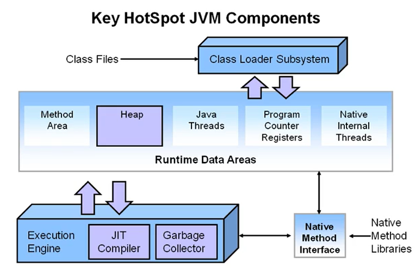

- 传统的堆内存(`1.6`及之前)划分：

  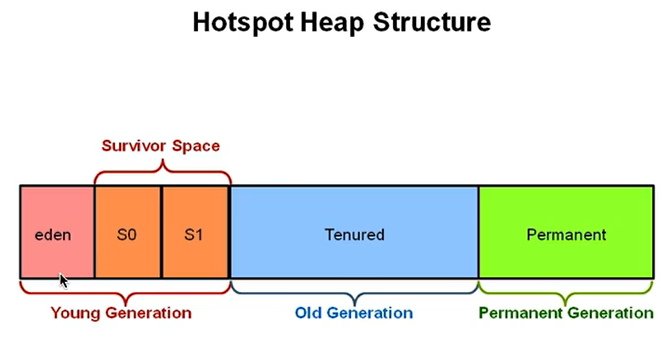

### G1 vs CMS

#### 异

- `G1`使用复制算法，内存回收后马上同时做合并空闲内存的工作，不会产生内存碎片；`CMS`使用标记清除算法，会产生内存碎片，只能在`Full GC`时用`STW`整理碎片。
- `G1`使用了`gc`停顿可预测的模型，可通过设置停顿时间来控制垃圾收集时间，避免应用雪崩现象。`CMS`没有。
- `G1`的`Eden`、`Survivor`以及老年代不再固定，内存使用效率上更灵活
- `G1`不要求额外内存空间。(`CMS`需要预留空间存储浮动垃圾)
- `G1`可以同时清理新生代和老年代，`CMS`只能清理老年代。
- `G1`是一种带压缩的收集器，在回收`region`时，将存活的对象从一个分区拷贝到另一个可用分区，这个过程中进行压缩以释放内存(`CMS`没有压缩，`Prallel Old`收集器会进行全堆的压缩，这样会导致较大的停顿时间)。
- `G1`并非一个实时的收集器，与`Parallel Scavenge`一样，对`gc`停顿时间的设置并不绝对生效。 

#### 同

- 与用户线程同时工作，几乎不需要`STW`(与`CMS`类似)。

### `G1`适合场景

- 服务端多核`CPU`、`jvm`内存占用较大的应用。
- 应用在运行过程中会产生大量内存碎片、需要经常压缩空间。
- 想要更可控、可预期的`GC`停顿周期，防止高并发下应用雪崩现象。

### `G1`内存划分

- `Heap`被划分为**一个个相等的不连续的**内存区域`region`，每个`region`都有一个分代角色：`eden`、`survivor`、`old`。

- 对每个角色的数量并没有强制的限定，即每种分代内存的大小可以动态变化。

- 每个`region`可能是新生代也可能是老年代，但在同一时刻只能属于某个代。

- `G1`最大的特点就是高效的执行回收，优先去执行那些大量对象可回收的`region`。

- 依然是在新生代满了的时候，对整个新生代进行回收。新生代的对象要么回收，要么晋升。

- `G1`使用了`gc`停顿可预测的模型，开满足用户所设定的`gc`停顿时间，根据用户设定的目标时间，`G1`会自动选择哪些`region`要清除，一次清除多少`region`。

  


### G1重要概念

- 收集集合(`CSet`)：一组可被回收的分区的集合。在`CSet`中存活的数据会在`GC`过程中被移动到另一个可用分区，`CSet`中的分区可以来自`eden`、`survivor`、老年代。

- 已记忆集合(`RSet`)：`RSet`记录了其他`region`中的对象引用本`region`中对象的关系，属于`points-into`结构。`RSet`的价值在于使得收集器不需要扫描整个堆找到谁引用了当前`region`中的对象，只需要扫描`RSet`即可。(`points-into`：即记录谁指向了我)

  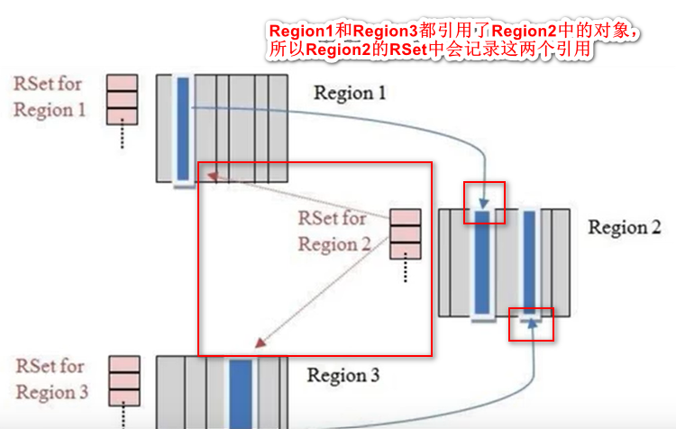

- `G1 GC`是在`points-out`的`card table`之上再加了一层结构来构成`points-into RSet`：每个·`region`会记录下到底哪些别的`region`有指向自己的指针，而这些指针分别在哪些`card`的范围内

- 这个`RSet`其实是一个`hash table`，`key`是别的`region`的起始地址，`value`是一个集合，里面的元素是`card table`的`index`。举例来说，如果`region A`的`RSet`里有一项的`key`就是`region B`,`value`里有`index`为`1234`的`card`，意思就是`region B`的一个`card`里有引用指向`region A`。所以对`region A`来说，该`RSet`记录的是`points-into`的关系；而`card table`中是`points-out`关系。

- `Snapshot-At-The-Beginning(SATB)`：`SATB`是`G1 GC`在并发标记阶段使用的增量式的标记算法。并发标记是并发多线程的，但并发线程在同一时刻只扫描一个分区。

### `G1`垃圾收集步骤   

#### `G1`的新生代垃圾收集

1. `G1`堆空间结构

   - `G1`采用一种不同的方法分配堆空间。堆是一整块内存空间，被划分为多个固定大小的`region`。`region`大小在`jvm`启动时可以指定。`jvm`可以划分`2000`个左右的`region`，它们的值从`1-32MB`。

     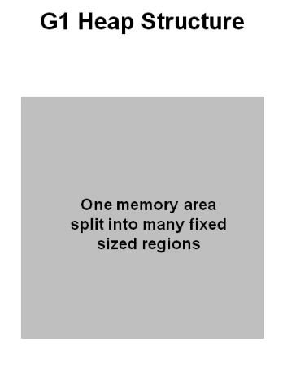

2. `G1`堆的分配

   - 实际上，这些`region`会被映射成`eden`、`survivor`和老年代的逻辑上的表示。

   - 存活的对象就会从一个`region`移动到另一个`region`上。这些`region`被设计成是并发的，不会阻止其他线程运行。

   - `region`被分为`eden`、`survivor`、老年代3个区域，此外还有第4种对象叫`Humongous region`，这个`region`中持有的对象大小超过了标准`region`的`50%`或以上，他们会被存储在一个连续的`region`集合中，最后一种是未被使用的堆空间。

     

3. `G1`中的新生代

   - 堆会被分成大约`2000`个`region`，最小的大小是`1MB`，最大的大小是`32MB`。

     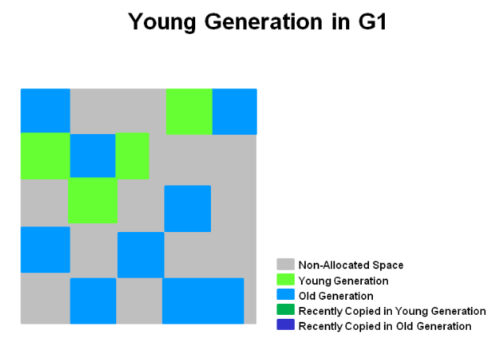

   - `region`可以不是连续的。

4. `G1`中新生代的垃圾收集

   - 存活对象会复制或移动到一个或多个`survivor region`中，如果年龄阈值满足了，一些对象就会进入老年代。

   - 这里会有一个`STW`的暂停。会计算`eden`和`survivor`的大小以便下次新生代的`GC`。这些信息也会保存起来以便计算大小，暂停时间目标也会被考虑进来。

   - 这种方式使得我们可以很容易改变`region`大小，使得它们更大或更小。

     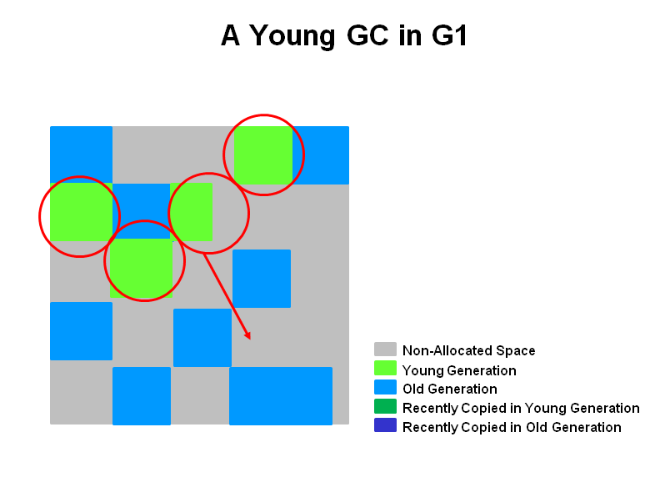

5. `G1`新生代`GC`结束

   - 存活对象会被移动到`survivor`空间中或老年代空间中。

     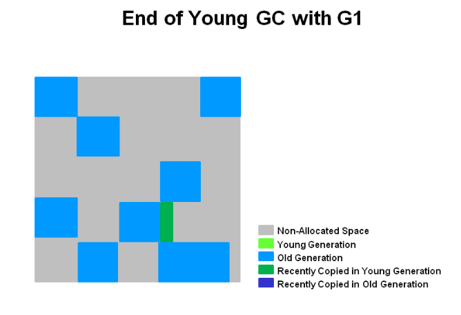

- 总结
  - 堆是一个单个的内存空间，被划分为多个`region`。
  - 新生代的内存空间是有不连续的`region`构成的。这使得我们可以根据需要调整它的大小。
  - 新生代`GC`会出现`STW`事件，所有的应用线程会暂停下来。
  - 新生代的`GC`会通过多线程方式来并行完成的。
  - 存活对象会被复制到新的`survivor`或老年代当中。

#### `G1`的老年代垃圾收集

- 和`CMS`收集器一样，针对老年代对象`G1`被设计成低停顿的收集器。

1. 初始标记(`initial mark`、`STW`)

   - 初始标记会标记由新生代所引用的对象，在日志中会被标记为`GC pause (young) (inital-mark)`

     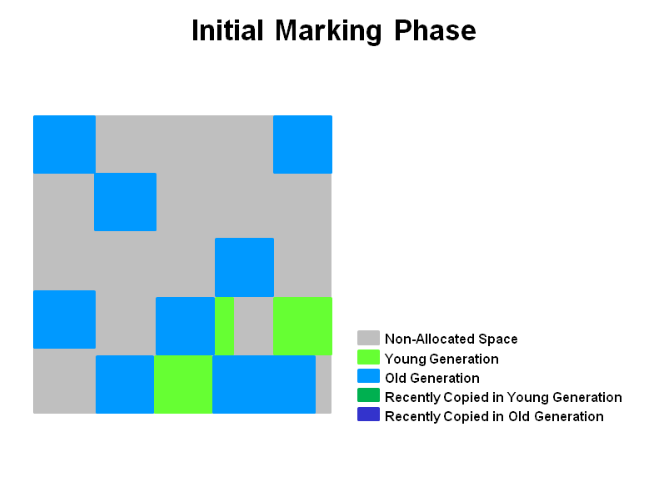

2. 根分区扫描(`Root Region Scanning`)

   - 扫描`survivor`分区中对老年代的引用，这个阶段必须在新生代可以发生`GC`之前完成。

3. 并发标记(`Concurrent Marking`)

   - 如果找到了一些空的分区(用`X`表示)，他们就会从`remark`阶段被移除，此外，`"accounting"`信息也会决定存活的计算。

     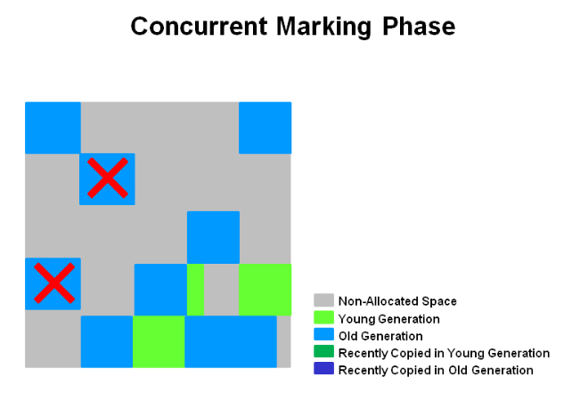

4. 重新标记(`Remark`、`STW`)

   - 空的`region`会被移除和收回。`region`的存活性会针对所有的`region`进行计算。

     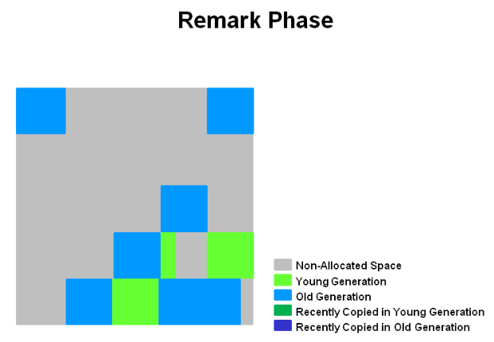

5. 并发清除(`Cleanup`、`STW`) / 复制(`Copying`、`STW`)

   - `G1`会选择哪些`region`的存活率最少，说明这些区域可回收的对象最多，回收速度也是最快的。这些`region`会和新生代同时进行收集。在日志中标记为`[GC pause (mixed)]`。因此所有的新生代和老年代是同时被收集的

     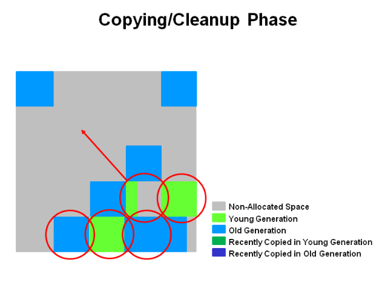

6. 复制或清理阶段之后

   - 选择的`region`已经被压缩了。

     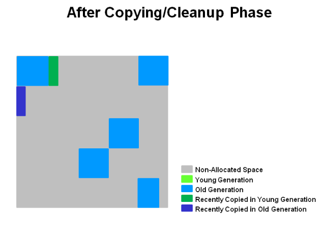

- 总结
  - 并发标记阶段
    - 在应用运行时的同时，对象的存活信息会被计算出来
    - 这些存活信息会用来标识哪些区域是最佳的回收区域
    - 没有`CMS`中的清除阶段
  - 重新标记阶段
    - `G1`使用`Snapshot-At-The-Beginning(STAB)`算法会比在`CMS`中使用更快。
    - 完全空的`region`会被回收
  - 复制/清理阶段
    - 新生代和老年代同时被回收
    - 老年代的`region`会基于它的存活性进行一个选择

### `G1`收集概览

- `G1`算法将堆分为若干个`region`，它仍然属于分代收集器，不过，这些`region`的一部分包含新生代，新生代的垃圾收集依然采用`STW`的方式，将存活对象拷贝到老年代或者`Survivor`空间。老年代也分成很多`region`，`G1`收集器通过将对象从一个`region`复制到另一个`region`，完成了清理工作。这就意味着，在正常的处理过程中，`G1`完成了堆的压缩(至少是部分堆的压缩)，这样也就不会有`CMS`内存碎片问题的存在了。

### `Humongous Region`

- 在`G1`中，还有一种特殊的`region`，叫`Humongous Region`。如果一个对象占用的空间达到或是超过了`region`容量的`50%`以上，`G1`收集器就认为这是一个巨型对象，这些巨型对象默认直接分配在老年代，但是如果他是一个短期存在的巨型对象，就会对垃圾收集器造成负面影响。为了解决这个问题，`G1`划分了一个`Humongous Region`，他用来专门存放巨型对象。如果一个`Humongous Region`装不下一个巨型对象，那么`G1`会寻找连续的`Humongous Region`来存储。为了能找到连续的`Humongous Region`，有时候不得不启动`Full GC`。

### `G1 GC`模式

- `G1`提供了两种`GC`模式：`Young GC`和`mixed gc`。两种都是需要`STW`的。
  - `Young GC`
    - 收集**所有**新生代里的`region`，通过控制新生代的`region`个数，即新生代内存大小，来控制`Young GC`的时间开销。
  - `mixed gc`
    - 选定所有新生代里的`region`，外加根据`global concurrent marking`统计得出收集收益高的若干老年代`region`，在用户指定的开销范围内竟可能选择收益高的老年代`region`。
- 分代的`G1`模式下选择`CSet`有两种子模式，分别对应`Young  GC`和`Mixed GC`。
  - `Young GC`
    - `CSet`就是所有新生代里的`Region`。
  - `Mixed GC`
    - `CSet`就是所有新生代里的`Region`加上`global concurrent marking`阶段标记出来的收益高的`Region`。

#### `Young GC`

- `Young GC`是在`eden`区充满时触发，在回收之后所有之前属于`eden`的`region`全部变成空白，即不属于任何一个分区(`edeb`、`survivor`、老年代)。
- `Young GC`主要是对`Eden`进行`GC`，它在`Eden`空间耗尽时会被触发。在这种情况下，`Eden`空间的数据移动到`Survivor`空间中，如果`Survivor`空间不够，`Eden`空间的部分数据会直接晋升到老年代空间中。`Survivor`区间的数据移动到新的`Survivor`中，也有部分数据晋升到老年代中。最终`Eden`空间数据为空，`GC`完成工作，用户线程继续执行。
- `GC`新生代对象，`G1`引入了`RSet`的概念，作用是跟踪指向某个`heap`区内的对象引用。每次`GC`时，新生代都会被扫描，所以只需要记录老年代到新生代之间的引用即可。不需要记录新生代与新生代之间的引用。
- 如果引用的对象很多，赋值器需要对每个引用做处理，赋值器开销会很大，所以`G1`中又引入了另外一个概念叫`Card Table`。一个`Card Table`将一个分区在逻辑上划分为固定大小的连续区域，每个区域称之为`card`，卡通常较小，介于`128`到`512`字节之间。`Card Table`通常为`byte []`，由`Card`的索引(即数组下标)来标识每个分区的空间地址。
- 默认情况下，每个`Card`都未被引用。当一个地址空间被引用时，这个地址空间对应的数组索引的值也被标记为`0`，即标记为被引用，另外`RSet`也将这个数组下标记录下来。一般情况下，这个`RSet`其实是一个`Hash Table`，`Key`是别的`Region`的其实地址，`Value`是一个集合，里面的元素时`Card Table`的`index`。

#### `Mixed GC`

- `mixed gc`不是`Full GC`，它只能回收部分老年代的`region`，如果`mixed gc`实在无法跟上程序分配内存的速度，导致老年代填满了无法继续进行`mixed gc`时，就会使用`serial old GC (Full GC)`来收集整个`GC Heap`，所以本质上，`G1`不提供`Full GC`的。

- `Mixed GC`分为两步：全局并发标记( `global concurrent marking`)、拷贝存活对象(`evacuation`)。

- `mixed GC`由一些参数控制，另外也控制着哪些老年代`region`会被纳入到`CSet`中。

  - `G1HeapWastePercent`

    - 在 `global concurrent marking`结束之后，我们可以知道老年代`region`中有多少空间要被回收，在每次`Young GC`之后和再次发生`Mixed GC`之前，会检查垃圾占比是否达到此参数，只有达到了，下次才会发生`Mixed GC`。

  - `G1MixedGCLiveThresholdPercent`

    - 老年代`region`中的存活对象的占比，只有在此参数之下，才会被选入`CSet`(即存活的对象占比少于这个值就回收)。

  - `G1MixedGCCountTarget`

    - 一次 `global concurrent marking`之后，最多执行`mixed GC`的次数。

  - `G1OldCSetRegionThresholdPercent`

    - 一次`Mixed GC`中能被选入`CSet`的最多老年代`region`的数量。

    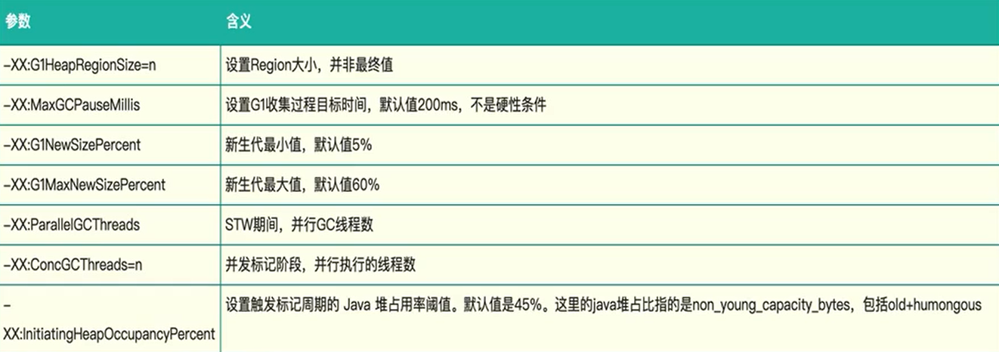

#### `global concurrent marking`

-  `global concurrent marking`的执行过程类似于`CMS`，但不同的是，在`G1 GC`中，它主要为`mixed gc`提供标记服务的，并不是一次`GC`过程的一个必须环节。
- `global concurrent marking`分为4个步骤：
  - 初始标记(`initial mark`、`STW`)
    - 它标记了从`GC Roots`开始可以直接可达的对象。
  - 并发标记(`concurrent marking`)
    - 这个阶段从`GC Roots`开始对`heap`中的对象进行标记，标记线程与应用线程并发执行，并且收集各个`region`的存活信息。
  - 重新标记(`remark`、`STW`)
    - 标记那些在并发标记阶段发生变化的对象，将被回收。
  - 清理(`cleanup`)
    - 清除空`region`(没有存活对象的`region`)，加入到`free list`。
- 第一阶段`initial mark`是共用了`Young GC`的暂停，这是因为它们可以复用`root scan`操作，所以可以说 `global concurrent marking`是伴随`Young GC`而发生的。
- 第四阶段`cleanup`只是回收了没有存活对象的`region`，所以它并不需要`STW`。

### 三色标记算法

- 它是描述追踪式回收期的一种有效的方法，利用它可以推演回收器的正确性。

- 我们将对象分为3种类型

  - 黑色：根对象，或者该对象与它的子对象都被扫描过(对象被标记了，且它的所有`field`也被标记完了)。
  - 灰色：对象本身被扫描，但还没扫描完该对象中的子对象(它的`field`还没有被标记或者标记完)
  - 白色：未被扫描的对象，扫描完所有对象之后，最终为白色的为不可达对象，即垃圾对象(对象没有被标记到)。


  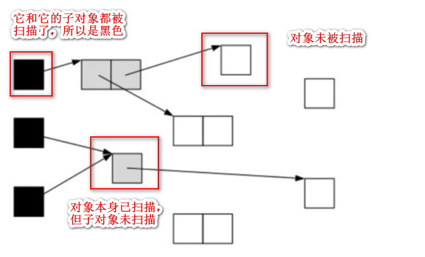
  - 继续由灰色遍历，将已扫描了子对象的对象值为黑色

    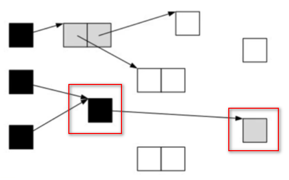

  - 遍历了所有可达对象后，所有可达对象都变成了黑色，不可达的对象即为白色，需要清理。

    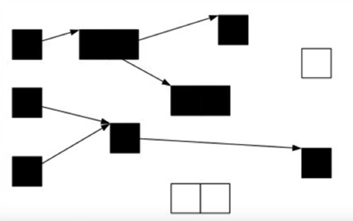

#### 三色标记法漏标问题

- 在标记过程中，用户线程也在运行，**对象的指针可能发成改变，导致应该得到标记的对象没有得到标记，也可能产生新的对象，新产生的对象可能未标记。**
  - 比如初始时

  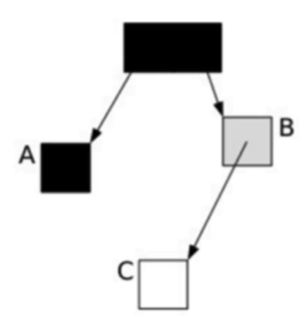

  - 如果这时执行

  ```java
  A.c = C
  B.c = null
  ```

  - 那么就变成

  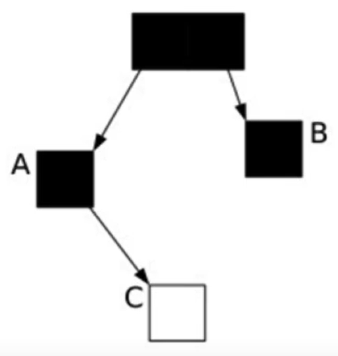
  
  - `A`原来已经被扫描完了，不会再扫描了，而`C`作为一个白色标记的对象，就会被回收，但是`A`又有引用指向`C`，这就是出现漏标。

### SATB  (`Snapshot-At-The-Beginning`)

- `SATB`有3个步骤：

  1. 在开始标记的时候生成一个快照图，标记存活对象。

  2. 在并发标记的时候所有被改变的对象入队。(**在`write barrier`里把所有旧的引用所指向的对象都变成非白的**)

  3. 可能产生浮动垃圾，将在下次被收集。

     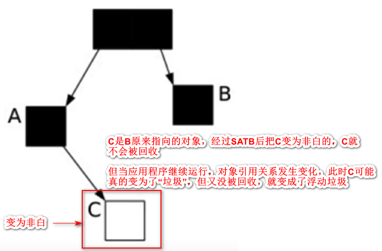

- `SATB`是`GC`开始之前对堆内存里的对象做一次快照，此时活的对象就认为是活的，从而形成一个对象图。
- 在`GC`收集的时候，新生代的对象也认为是活的对象，除此之外其他不可达的对象都认为是垃圾对象。

#### 并发GC问题一：收集时如何处理新生成的对象

- 如何找到在`GC`过程中新分配的对象呢？每个`region`记录着两个`top-at-mark-start(TAMS)`指针，分别为`prevTAMS`和`nextTAMS`。在`TAMS`以上的对象就是新分配的，因而被视为隐式`marked`(即隐含的做了标记)。通过这种方式找到了在`GC`过程中新分配的对象并认为它们是活的。

#### 并发GC问题二：收集时对象引用发生变更

- 通过`write barrier`把所有旧的引用所指向的对象都变成非白的。通过`write barrier`就可以了解到哪些引用对象发生了什么样的变化。
- 漏标情况只会发生在白色对象中，且满足以下任意一个条件：
  - 并发标记时，应用线程给一个黑色对象的引用类型字段赋值了白色对象。
  - 并发标记时，应用线程删除所有灰色对象到该白色对象的引用。
- 对于第一种情况，利用`post-write barrier`，记录所有新增的引用关系，然后根据这些引用关系为根重新扫描一遍。
- 对于第二种情况，利用·`pre-write barrier`，将所有即将被删除的引用关系的旧引用记录下来，最后以这些旧引用为根重新扫描一遍。

### G1混合式回收

- `G1`现在可以 知道哪些老年代`region`可回收垃圾最多。当全局并发标记完成后，在某个时刻，就开始`Mixed GC`。这些垃圾回收被称作“混合式”是因为它们不仅仅进行正常的新生代垃圾收集，同时也回收部分后台扫描线程标记的分区
- 混合式`GC`也是才用的复制策略，当`GC`完成后，会重新释放空间。

### 停顿预测模型

- `G1`收集器突出表现出来的一点是通过一个停顿预测模型根据用户配置的停顿时间来选择`CSet`的大小，从而达到用户期待的应用程序暂停时间。
- 通过`-XX:MaxGCPauseMillis`参数来设置，一般与设置`100ms`到`200ms`都行，如果设置的太短，可能导致`G1`跟不上垃圾产生的速度，从而导致`Full GC`，这一点类似于`Parallel Scavenge`，停顿时间并不是越短越好。

### G1最佳实践

- 不要设置新生代和老年代大小
  - `G1`运行时会自动调整新生代和老年代大小，如果设置了新生代大小相当于放弃了`G1`自动调优。
- 关注`Evacuation Failure`
  - `Evacuation Failure`类似于`CMS`里面的晋升失败，堆空间垃圾太多导致无法完成`Region`之间的拷贝，于是不得不退化成`Full GC`来做一次全局范围内的垃圾收集。

### G1日志

> 代码实例 cn.andios.jvm.g1.MyTest1
>
> ```java
> /**
>  *  -verbose:gc
>  * -Xms10M
>  * -Xmx10M
>  * -XX:+UseG1GC
>  * -XX:+PrintGCDetails
>  * -XX:+PrintGCDateStamps
>  * -XX:MaxGCPauseMillis=200m
>  */
> public class MyTest1 {
>     public static void main(String[] args) {
>         int size = 1024 * 1024;
>         byte [] myAllocate1 = new byte [size];
>         byte [] myAllocate2 = new byte [size];
>         byte [] myAllocate3 = new byte [size];
>         byte [] myAllocate4 = new byte [size];
>         System.out.println("end");
>     }
> }
> ```

- 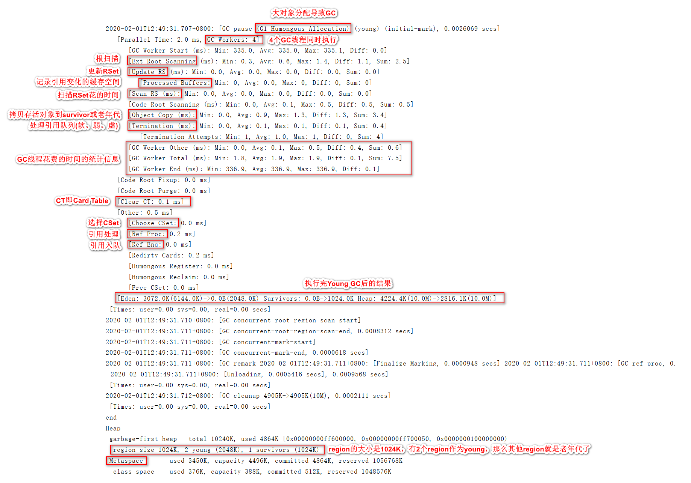