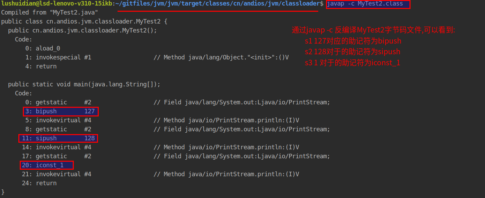

[toc]

## 类加载

java代码中,类型的加载\连接\初始化过程都是在程序运行期间完成的.

在如下几种情况下,jvm将结束生命周期

   - 执行了`System.exit()`方法
   - 程序正常执行结束
   - 程序在执行过程中遇到了异常或错误而终止
   - 由于操作系统出现错误而导致jvm进程终止

### 类的加载\连接\初始化

1. 加载:**查找并加载类的二进制数据**

   ​		**将类的.class文件中的二进制数据读入到内存,将其放在运行时数据区的方法区中,然后在内存中创建一个`java.lang.Class`对象用来封装类在方法区内的数据结构.**(规范并未说明class对象位于哪里,hotspot虚拟机将其放在了方法区中)

   加载.class文件的方式

	- 从本地系统直接加载
	- 通过网络下载.class文件
	- 从zip,jar等归档文件中加载.class文件
	- **将java源文件动态编译为.calss文件(如jsp文件被编译为servlet文件再由虚拟机加载)**

2. 连接

   - 验证:**确保被加载的类的正确性**

   - 准备:**为类的静态变量分配内存,并将其初始化为默认值**

   - 解析:**类中的符号引用转换为直接引用**

3. 初始化:**为类的静态变量赋予正确的初始值**

4. 使用

5. 卸载

java程序对类的使用分为两种使用

- 主动使用
  - 创建类的实例
  - 访问某个类或接口的静态变量,或者对该静态变量赋值
  - 调用类的静态方法
  - 反射
  - 初始化一个类的子类
  - java虚拟机启动时被标明为启动类(包含main方法的类)的类
  - jdk1.7开始的动态语言支持(`java.lang.invoke.MethodHandle`实例的解析结果`REF_getStatic,REF_putStatic,REF_invokeStatic`句柄对应的类没有初始化,则初始化)
- 被动使用
  - 除了上面7种情况,其他使用java类的方式都被看作是对类的被动使用,都不会导致类的初始化.

所有的jvm必须实现在每个类或接口被java程序"首次主动使用"时才初始化它们.

> 代码实例 cn.andios.jvm.classloader.MyTest1

```java
/**
 *  -XX:+ TraceClassLoading:用于追踪类的加载信息并打印出来
 *
 *  -XX:+<option>表示开启option
 *  -XX:-<option>表示关闭option
 *  -xx:<option>=<value>表示将option选项值设置为value
 */
public class MyTest1 {
    public static void main(String[] args) {
        System.out.println(MyChild1.str);
//        result:
//          MyParent1 static block
//          hello world
//        reason:
//          对于静态字段来说,只有直接定义了该字段的类才会被初始化,这里只是主动使用MyParent1,并没有主动使用MyChild1,
//        虽说是通过子类的名字来引用str,但str是父类定义的.所以不会初始化MyChild1

        //System.out.println(MyChild1.str2);
//        result:
//          MyParent1 static block
//          MyChild1 static block
//          hello
//        reason:
//          str2在子类中定义,相当于对子类的主动使用,所以会先初始化父类,再初始化子类

    }
}

class MyParent1{
    public static String str = "hello world";
    static {
        System.out.println("MyParent1 static block");
    }
}

class MyChild1 extends MyParent1{
    public static  String str2 = "hello";
    static {
        System.out.println("MyChild1 static block");
    }
}
```

> ```
> -XX:+ TraceClassLoading:用于追踪类的加载信息并打印出来
> ```

通过`-XX:+ TraceClassLoading`参数追踪执行`System.out.println(MyChild1.str);`时类加载情况:

```v
...
[Loaded cn.andios.jvm.classloader.MyTest1 from file:/home/lushuidian/gitfiles/jvm/jvm/target/classes/]
...
[Loaded cn.andios.jvm.classloader.MyParent1 from file:/home/lushuidian/gitfiles/jvm/jvm/target/classes/]
[Loaded cn.andios.jvm.classloader.MyChild1 from file:/home/lushuidian/gitfiles/jvm/jvm/target/classes/]
MyParent1 static block
hello world
...
```

可以看到它会先加载`MyTest1`,再加载`MyParent1`,最后加载`MyChild1`

> 代码实例 cn.andios.jvm.classloader.MyTest2

```java
package cn.andios.jvm.classloader;
/**
 * 常量在编译阶段会存入到调用这个常量的方法所在的类的常量池中,
 * 本质上,调用类并没有直接引用到定义常量的类,因此并不会触发定义常量的类初始化
 *
 * 注意:这里指的是将常量存入到MyTest2的常量池中,之后MyTest2与MyParent2就没有
 *      任何关系了,甚至,可以将MyParent2的.class文件删除
 *
 *  助记符(javap -c  xxx.class反编译命令后的结果)
 *      ldc:表示将int,float或者是String类型的常量值从常量池中推送至栈顶
 *      bipush:表示将单字节(-128-127)的常量值推送到栈顶
 *      sipush:表示将一个短整型常量值(-32768-32767)推送至栈顶
 *      iconst_1:表示将int类型1推送到栈顶(iconst_m1-iconst_5分别表示将int类型-1到5推送到栈顶,超过5就是bipush,低于-1就是bipush)
 */
public class MyTest2 {
    public static void main(String[] args) {
//        System.out.println(MyParent2.str);
//        result:
//          MyParent2 static block
//          hello world
//        System.out.println(MyParent2.str2);
//        result:
//          hello
//        reason:
//          常量在编译阶段会存入到调用这个常量的方法所在的类的常量池中,本质上,调用类并没有直接引用到定义常量的类,因此并不会触发定义常量的类初始化
//        即str2在编译阶段会存入到MyTest2的常量池中,MyTest2并没有直接引用到MyParent2这个类,所以MyParent2类不会被初始化
//

        System.out.println(MyParent2.s1);
        System.out.println(MyParent2.s2);
        System.out.println(MyParent2.s3);
    }
}

class MyParent2{
//    public static String str = "hello world";
//    public static final String str2 = "hello ";
    public static final short s1 = 127;
    public static final short s2 = 128;
    public static final short s3 = 1;
    static {
        System.out.println("MyParent2 static block");
    }
}
```

上述代码运行后,可通过`javap -c `反编译命令查看如下:




如果将s1,s2,s3,str注释掉,只保留str2,编译运行后反编译得到


这里助记符`ldc`表示将int,float或者是String类型的常量值从常量池中推送至栈顶,str2是由final修饰的字符串常量.


如果将s1,s2,s3,str2注释掉,只保留str,编译运行后反编译得到


这个的str不再是常量,所以由助记符`getstatic`来表示.


> 代码实例 cn.andios.jvm.classloader.MyTest3

```java

/**
 * 当一个常量的值并非编译期间可以确定的,那么其值就不会被放到调用类的常量池中,
 * 这时在运行程序时,会导致主动使用这个常量所在的类,显然会导致这个类被初始化
 */
public class MyTest3 {
    public static void main(String[] args) {
        System.out.println(MyParent3.str);
//        result:
//          MyParent3 static static block
//          f3c1e34d-01fd-4450-95e8-a682ea983ce9
//        reason:
//          str的值在编译期不能确定,所以不会放到MyTest3的常量池中,
//          运行程序时,就会导致MyParent3的初始化
    }
}

class MyParent3{
    public static final String str = UUID.randomUUID().toString();
    static {
        System.out.println("MyParent3 static static block");
    }
}
```


> 代码实例 cn.andios.jvm.classloader.MyTest4

```java
/**
 * 对于数组实例来说,其类型是由jvm在运行期动态生成的,
 * 动态生成的类型,其父类型就是Object
 *
 * 对于数组来说,javadoc经常将构成数组的元素成为component,实际上就是将数组降低一个维度后的类型
 *
 * 通过 javap-c xxx.class 反编译,可以看到两个助记符
 *      anewarray:表示创建一个引用类型(类\接口\数组)的数组,并将其值压入栈顶
 *      newarray:表示创建一个指定的原始类型(int\float\char)的数组,并将其值压入栈顶
 */
public class MyTest4 {
    public static void main(String[] args) {
        //MyParent4 myParent4 = new MyParent4();
//        result:
//          MyParent4  static block
//        reason:
//          表示对类MyParent4的主动使用

        MyParent4 [] myParents1 = new MyParent4[5];
//        result:
//          (没有输出)
//        reason:
//          不表示对MyParent4的主动使用,
        System.out.println(myParents1.getClass());//class [Lcn.andios.jvm.classloader.MyParent4;
        System.out.println(myParents1.getClass().getSuperclass());//class java.lang.Object

        MyParent4 [][] myParents2 = new MyParent4[5][5];
//        result:
//          (没有输出)
//        reason:
//          不表示对MyParent4的主动使用,
        System.out.println(myParents2.getClass());//class [[Lcn.andios.jvm.classloader.MyParent4;
        System.out.println(myParents2.getClass().getSuperclass());//class java.lang.Object

        int [] arr = new int[5];
        System.out.println(arr.getClass());//class [I
        System.out.println(arr.getClass().getSuperclass());//class java.lang.Object
    }
}
class MyParent4{
    static {
        System.out.println("MyParent4  static block");
    }
}
```


>代码实例 cn.andios.jvm.classloader.MyTest5

```java
/**
 * 当一个接口在初始化时,并不要求其父接口都完成了初始化
 *      (接口中变量都由final修饰,都是常量,但类中的变量不一定都由final修饰,如果没有被final
 *      修饰,就不会被纳入到常量池中,那么这个类被初始化时就会导致它的父类被初始化.)
 * 只有在真正使用到父接口的时候(如引用接口中所定义的常量时),才会初始化
 */
public class MyTest5 {
    public static void main(String[] args) {
        /**
         * a,b
         *
         * result:6
         * 编译后,删掉MyParent5.class,再运行,正常打印
         */
        System.out.println(MyChild5.b);

        /**
         * a,c
         *
         * result:一个随机值
         * 编译后,删除MyParent5.class,再运行,报错
         * reason:c的值是在运行期动态生成的
         */
        System.out.println(MyChild5.c);

        /**
         * d,e
         * result:2
         * case1:编译后,删除MyParent5.class,再运行,正常打印
         * case2:将MyParent5,MyChild5改为class,其他不变,编译后,
         *      删除MyParent5.class,再运行,报错
         * reason:对于接口来说,d,e都是常量(都由final修饰),会被纳入到常量池,
         *      初始化时不会导致父类被初始化;
         *         改为class后,不是常量,不会被纳入到常量池,被使用时就会导致父类初始化,
         *         所以删除MyParent.class后再运行就报错
         *
         */
        System.out.println(MyChild5.e);
    }
}

interface MyParent5{
    int a = 1;
    
    int d = new Random().nextInt(3);
}

interface MyChild5 extends MyParent5{
    int b = 2;
    int c = new Random().nextInt(2);

    int e = 2;
}
```


> 代码实例 cn.andios.jvm.classloader.MyTest6

```java
public class MyTest6 {

    public static void main(String[] args) {
        Singleton singleton = Singleton.getInstance();
        /**
         * result:
         *      counter1:1
         *      counter2:1
         *      counter3:1
         *
         *      main-counter1:1
         *      main-counter2:1
         *      main-counter3:0
         *  这里main方法中调用Singleton的静态方法getInstance(),
         *  是对Singleton的主动使用,所以Singleton类会被初始化,在初始化之前会经过
         *  准备阶段,为变量赋默认值,counter1,counter2,counter3默认值都是0,singleton
         *  默认值是null
         *
         *  紧接着调用getInstance会导致这个类被初始化(从上到下),为各个变量赋初值,
         *  counter1没有赋值就为0,counter2赋初值为0,singleton变量的赋值就会执行构造方法,
         *  构造方法中,counter1,counter2会使用初始化之后的值,counter3会使用准备阶段之后的值,都是0,
         *  所以++之后都为1,所以打印结果都是1
         *  接着往下执行,完成对counter3的初始化,将counter3赋为0,所以main中打印counter3为0.而不是1
         *
         */
        System.out.println("main-counter1:"+ Singleton.counter1);
        System.out.println("main-counter2:"+ Singleton.counter2);
        System.out.println("main-counter3:"+ Singleton.counter3);

    }


}
class  Singleton{
    public static int counter1;

    public static int counter2 = 0;

    private static Singleton singleton = new Singleton();

    private Singleton(){
        counter1 ++;
        counter2 ++;
        counter3 ++;
        System.out.println("counter1:"+counter1);
        System.out.println("counter2:"+counter2);
        System.out.println("counter3:"+counter3);
    }
    public static int counter3 = 0;

    public static  Singleton getInstance(){
        return  singleton;
    }
}
```

### 类加载

- 类的加载的最终产品是位于内存中的Class对象

- Class对象封装了类在方法区内的数据结构,并且向java程序员提供了访问方法区内的数据结构的接口.

- 有两种类型的类加载器

  - java虚拟机自带的加载器
    - `bootstrap classloader`
    - `extension classloader`
    - `app classloader`
  - 用户自定义的类加载器
    - `java.lang.ClassLoader`的子类
    - 用户可以定制类的加载方式

- 类加载器并不需要等到某个类被"首次主动使用"时再加载它.

  比如在"代码实例 cn.andios.jvm.classloader.MyTest1"中,用`-XX:+ TraceClassLoading`参数追踪执行`System.out.println(MyChild1.str);`类加载情况时,明明只初始化`MyParent1`,但`MyChild1`也被加载了.